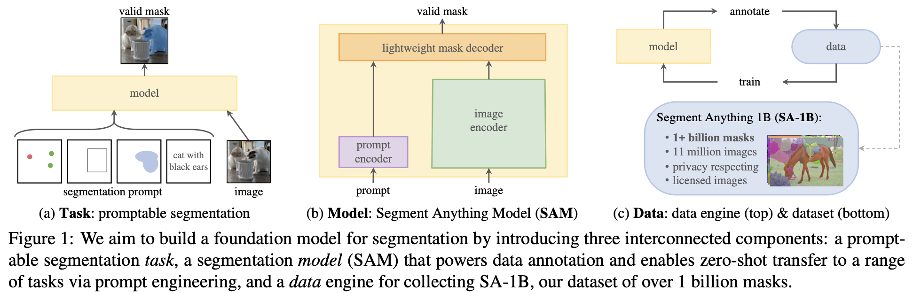

# Segment Anything

Author: <a href="https://yusijin02.github.io/">Sijin Yu</a>

[TOC]

## 0. Abstract

- 我们引入 **Segment Anything (SA)** 项目: 一个全新的图像分割任务、模型、数据集.
- 通过在数据收集循环中使用我们的高效模型, 我们构建了迄今为止最大的分割数据集, 包括超过 11M 张经过许可且尊重隐私的图像上的超过 1B 多个掩码 (masks).
- 模型被设计和训练为**可提示的 (promptable)**, 因此它可以 **zero-shot** 地迁移到新的图像分布和任务上.
- 我们在各种任务上评估了它的能力, 并且发现它的 zero-shot 表现非常惊人 -- 对于完全监督的结果总是具有竞争性, 甚至优于之.
- 我们开源了 **Segment Anything Model (SAM)** 和相关的数据集 **SA-1B**.

## 1. Motivation

- **提示工程 (prompt engineering)** 在大语言模型、CLIP 的文本-图像对比学习中展现出给模型带来 few-shot 甚至 zero-shot 的能力.
- 本文的目标是构建一个**图像分割的基础模型 (a foundation model for image segmentation)**. 即开发一个**可提示 (promptable)** 的模型, 并在广泛的数据集上**预训练 (pre-train)**, 以使得它有强大的泛化能力.
- 在三个部分去完成上述计划: **任务 (task)**, **模型 (model)** 和**数据 (data)**.

## 2. Contribution

- 在**任务 (task)** 层面 (上图 a):

  提出了**可提示的分割任务 (promptable segment task)**. 给定任意的分割提示 (segmentation prompt), 目标是返回一个有效的分割掩码 (valid segmentation mask).

  分割提示可以是各种形式的, 用于给出需要分割的物体, 如图, 包括: (1) 标点, (2) 矩形框, (3) 涂鸦区域, (4) 文本提示.

- 在**模型 (model)** 层面 (上图 b):

  模型必须做到: (1) 支持**灵活的提示 (flexible prompts)**, (2) 需要在摊销的**实时 (real-time)** 计算中生成掩码以支持交互式使用, (3) 必须具备**处理模糊性的能力 (ambiguity-aware)**.

  将模型分为三部分: (1) **图像编码器 (image encoder)** 用于计算图像嵌入 (image embedding), (2) **提示编码器 (prompt encoder)** 用于计算提示嵌入 (prompt embedding), (3) **掩码解码器 (mask decoder)** 用于预测分割掩码 (segmentation masks).

- 在**数据 (data) 层面** (上图 c):

  构建一个**数据引擎 (data engine)**, 包含三个阶段: (1) **人工辅助 (assisted-manual)**, SAM 辅助标注工去标注掩码, (2) **半自动 (semi- automatic)**, 通过提示物体可能的位置, SAM 为一个物体的子集生成掩码, 标注工关注剩余的物体, (3) **全自动 (fully automatic)** 用常规的前景网格 (regular grid of firegorund points) 提示 SAM, 每张图片得到平均大约 100 个高质量的掩码.

## 3. Framework

- **图像编码器 (image encoder)**

  使用了 MAE pre-trained ViT. 图像编码器在每张图像上只跑一次, 可以在提示模型之前使用. image encoder 输出一个 image embedding.

- **提示编码器 (prompt encoder)**

  考虑两种类型的提示: **稀疏提示 (sparse prompts)** (如点, 框, 文本), **密集提示 (dense prompts)** (如掩码).

  - 对于**稀疏提示 (sparse prompts)**, (1) 对点 (points) 和框 (boxes), embedding = 位置嵌入 (position embedding) + 提示类型嵌入 (prompt type embedding), (2) 对自由格式的文本 (free-form text), 使用了 CLIP 里的 text encoder.
  - 对于**密集提示 (dense prompts)**, 使用卷积获得 embedding.

- **掩码解码器 (mask decoder)**

  以 image embedding 和 prompt embedding 为输入, 以 mask 为输出. 主要使用了 Transformer Decoder Block 的变体.

  通过 self-attention 和 cross-attention 来更新**所有** embedding, 其中 self-attention 允许模型关注输入序列中不同位置的信息, 而 cross-attention 有两个方向, 即 prompt-to-image 和 image-to-prompt. 在经过如此的两个 blocks 后, 将 image embedding 做**上采样**, 一个 MLP 将输出的 token 映射为一个动态的线性分类器, 以计算每个图像位置的掩码前景概率.

  

## 4. Data

## 5. Experiment

